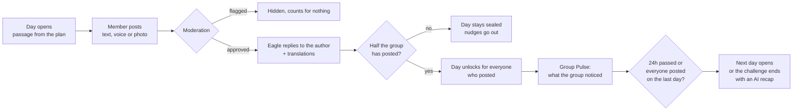
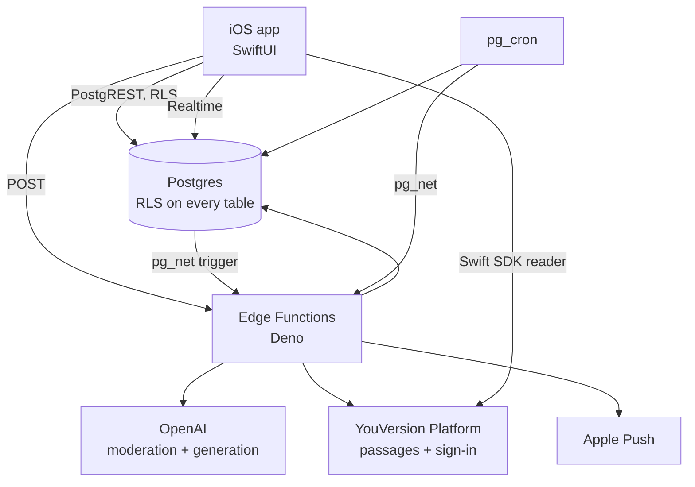

# Dwell — backend

**Dwell is a daily Bible-reading app for small groups of friends.** Two to seven people pick a reading plan, read the same passage each day, and post a short reflection in text, voice or a photo. The twist is the **sealed day**: you can't read anyone's reflection until you've posted your own *and* half the group has posted. Then the day unlocks for everyone at once, and an AI companion called Eagle reflects back what the group noticed together.

It's built for friends who want to stay in Scripture together but drift apart in a group chat: the sealed day makes showing up the price of seeing, and the AI does the noticing that busy people don't have time for.

This repository is the **Supabase backend**: Postgres schema and row-level security, Edge Functions (TypeScript/Deno), scheduled jobs and the AI pipeline. The iOS client (SwiftUI) lives in [Mulcro/dwell-frontend](https://github.com/Mulcro/dwell-frontend).

Built for the GLOO Hackathon 2026 by Mulero Alamou and Taylor Norman.

---

## How a day works



- **One day at a time.** The next day opens 24 hours after the current one opened, once it has unlocked, and only on the group's reading days (daily, weekdays, three or four times a week, or custom days), judged in the group's own timezone.
- **Late joiners and latecomers are treated fairly.** Each member gets their own 24-hour posting window, and the unlock math only counts people who were in the group when the day opened.
- **Quiet groups are caught, not punished.** A day nobody clears is skipped after a few days, three silent days prompt the group to continue, pause or end, and a fortnight of silence closes the challenge gently.
- **When everyone has posted on the final day, the challenge ends immediately** with a recap of what each person brought.

## How Dwell uses AI

AI runs through every stage of the loop, each piece at the tier it needs. Calls go to OpenAI from Edge Functions; the API key never leaves the server.

| Moment | What the AI does | Where | Model |
|---|---|---|---|
| A member posts | **Moderates** text, transcripts and images before anyone else can see them. Abuse aimed at a person is refused; honest frustration is not. | `submit-reflection`, `submit-comment`, `set-avatar` | `omni-moderation-latest` (multimodal) |
| A reflection is approved | **Eagle replies** to the author in their language, tags the reflection's mood, and **translates** it and the reply for every group-mate who reads another language. | `submit-reflection` | `gpt-4o-mini` |
| A reply is posted | **Translates** it for group-mates in other languages. | `submit-comment` | `gpt-4o-mini` |
| A day unlocks | **Group Pulse**: one headline about what *this* group noticed today, a kicker, a summary, and each member's stated intention in their own words. Rewritten as more people post. | `generate-group-pulse` | `gpt-4o` |
| Every Monday | **Weekly recap**: the thread the group kept coming back to, and one line per member on what they brought. | `weekly-cron-leaderboard` | `gpt-4o` |
| The challenge ends | **End-of-challenge recap**: how the group grew, what to carry forward, a line per member, and how many days they showed up. | `end-of-challenge-summary` | `gpt-4o` |
| A member falls behind | **Nudges** in-app and by push, timed to their local waking hours. | `daily-cron-nudge`, `send-push` | rules today |
| A voice reflection is recorded | **Transcription** on the device, so the audio never needs a server-side speech model. | iOS client | Apple Speech |

Design choices that matter:

- **Card generation never sends user ids to the model.** Members are numbered in the prompt and the answer is mapped back server-side, so attribution can't be hallucinated. Translating a finished card then sends its member ids along with the lines, so each translated line stays attributable.
- **Counts are computed, never generated.** "Three of you" is only said when three is true; the model is given the numbers and told not to invent others.
- **Optional AI work degrades instead of failing.** A card that can't be parsed falls back to prose; a failed translation posts untranslated; Eagle's reply failing never blocks a reflection from counting. **Moderation is the exception and fails closed:** if it can't complete, the post is not approved and is removed, so the member can retry. Every OpenAI call has a 60-second timeout.
- **Everything the AI writes is translated** for the languages the group actually reads, with member lines kept attributable.

## YouVersion Platform

- **Scripture:** the in-app reader is YouVersion's own `BibleReaderView` from their Swift SDK, handed each day's reference. `get-passage` is the server-side fetch: plain passage text from the YouVersion Platform API (Berean Standard Bible), cached permanently, with the app key kept on the server.
- **Sign-in:** `youversion-signin` verifies a YouVersion OIDC id_token against their JWKS and returns a single-use `token_hash`, which the client redeems with `verifyOtp` for a normal Supabase session. `yv-callback` relays their PKCE flow back into the app. See `docs/backend_design.md` section 2.

## Architecture



- **Two API surfaces.** Reads and simple writes go straight to PostgREST, guarded entirely by row-level security. Anything with logic, moderation, AI or side effects is an Edge Function.
- **The database enforces the rules that matter.** The unlock rule lives in RLS, the threshold flip and day completion in a trigger, "one challenge at a time" in a locked trigger, and "one recap per period" in unique indexes, so no client and no race can get around them.
- **Realtime** carries day progress, group membership and new insights to the app; reflections are deliberately not published, so a subscription can never leak a sealed day.

### Edge Functions

| Function | Called by | Purpose |
|---|---|---|
| `create-group`, `join-group` | app | Form a group; join by invite code or by one-tap "same crew, new plan" invitation |
| `submit-reflection`, `submit-comment` | app | Moderate, store, enrich and translate posts and replies |
| `group-challenge-action` | app | Continue, pause or end a quiet challenge |
| `set-avatar`, `delete-account` | app | Moderated profile pictures; full account erasure |
| `get-passage` | app | Cached plain passage text from YouVersion (the reader itself is YouVersion's SDK) |
| `youversion-signin`, `yv-callback` | app | YouVersion sign-in |
| `generate-group-pulse` | database trigger | The daily Group Pulse card |
| `end-of-challenge-summary` | challenge end (trigger, sweep, a member ending it, or expiry) | The closing recap |
| `daily-cron-nudge`, `send-push` | cron | Nudges in-app and over APNs |
| `daily-cron-autoskip`, `daily-cron-inactivity-check` | cron | Skip stalled days; prompt, pause or expire quiet groups |
| `weekly-cron-leaderboard` | cron | Weekly participation and the weekly recap |
| `cleanup-media` | cron | Remove storage objects for deleted content |
| `debug-day` | app debug menu | Move a group a day forward or back for testing; answers only when the `DEBUG_DAY_ENABLED` secret is set |

### Scheduled jobs

| Job | Schedule |
|---|---|
| Open the next day / complete the challenge | every 15 minutes |
| Nudges | every 15 minutes |
| Media cleanup | every 15 minutes |
| Skip stalled days | daily 00:15 UTC |
| Inactivity check | daily 00:30 UTC |
| Leaderboard and weekly recap | Mondays 00:00 UTC |

## Privacy and safety

- Row-level security on every table, deny by default. A reflection is readable by a group-mate only once the day has unlocked **and** the reader has an approved reflection of their own on it.
- Nothing is visible to anyone else until moderation approves it. Refused images and recordings are destroyed, not just hidden.
- Recordings and photos live in a private bucket behind the same unlock rule, served by short-lived signed URLs.
- Privileged database functions are revoked from client roles; the service key is server-side only.
- Deleting an account erases its reflections, replies, reactions and every stored recording.

## Repository layout

```
supabase/
  migrations/   48 migrations: schema, RLS, triggers, crons, seeded plans
  functions/    19 Edge Functions plus _shared (auth, AI client, APNs, cards)
  tests/        pgTAP tests for RLS, triggers and SQL functions
scripts/        smoke test, demo seed, day-advance and cover-art tools
docs/           backend_design.md (the full design), deployment notes
assets/         plan cover art: the team's Figma designs, plus generated placeholders
```

`docs/backend_design.md` is the source of truth for schema, API shapes and business rules.

## Running it

```bash
supabase start                     # local Postgres, Auth, Storage, Functions
deno task check                    # fmt, lint, type-check, 131 unit tests
supabase test db                   # 299 pgTAP tests across 34 files
supabase db lint                   # schema lint
deno task test:integration         # 5 integration suites against the local stack
./scripts/smoke-functions.sh       # boots the functions and calls them over HTTP
```

CI runs all of the above on every pull request.

## Built during the event

All work in this repository was done during the competition period: the first commit is dated 2026-09-21, after the 2026-09-08 start.

**Third-party services:** Supabase, OpenAI, the YouVersion Platform API and Apple Push Notification service. **Assets:** no paid assets. Scripture text is the Berean Standard Bible via YouVersion. Cover art for the three listed plans is the team's own Figma design, committed under `assets/plan-images/`; `scripts/make-plan-cover.py` generated the earlier placeholders.

## License

MIT — see [LICENSE](LICENSE).
